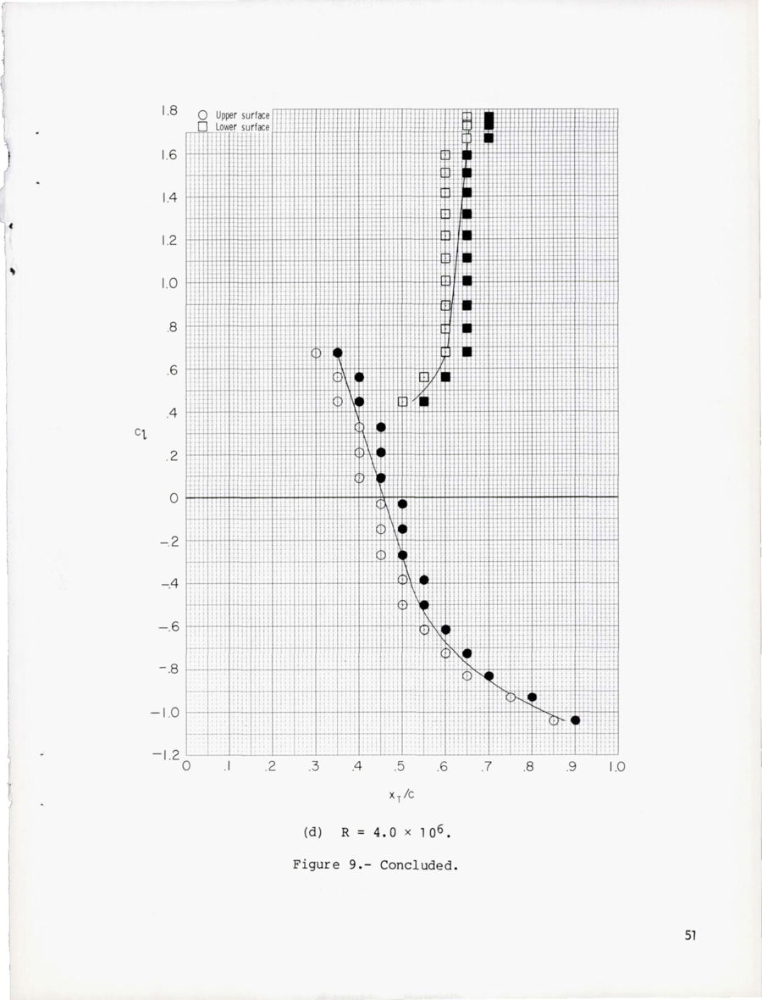
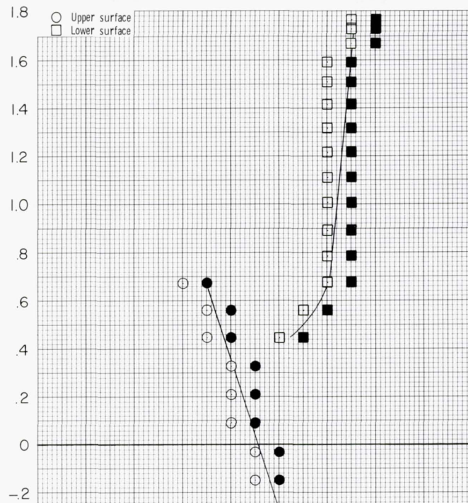
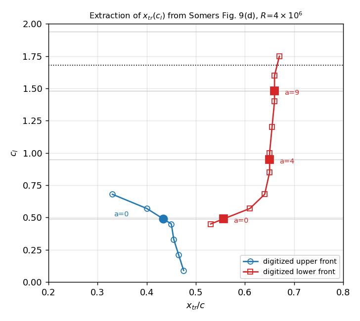
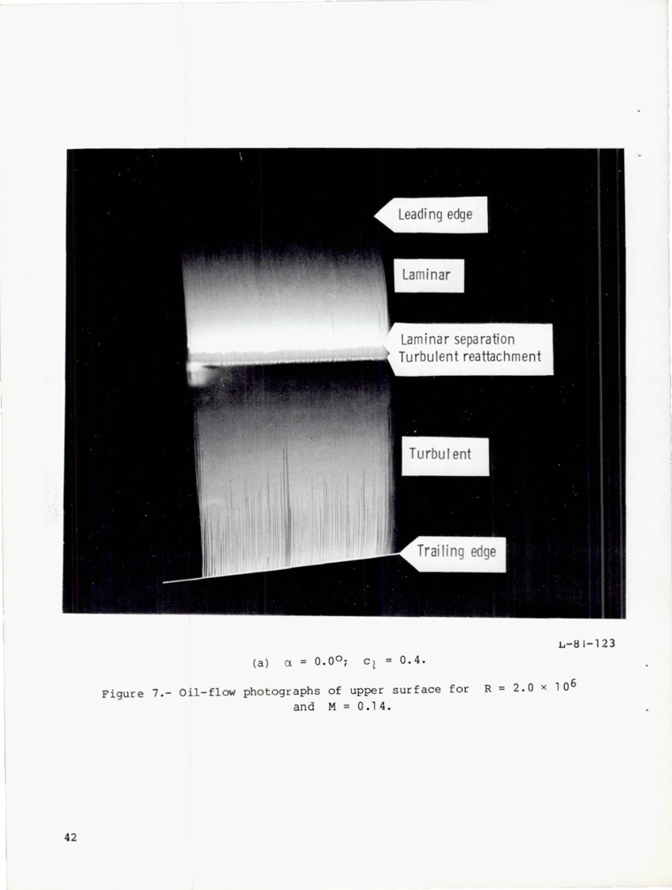
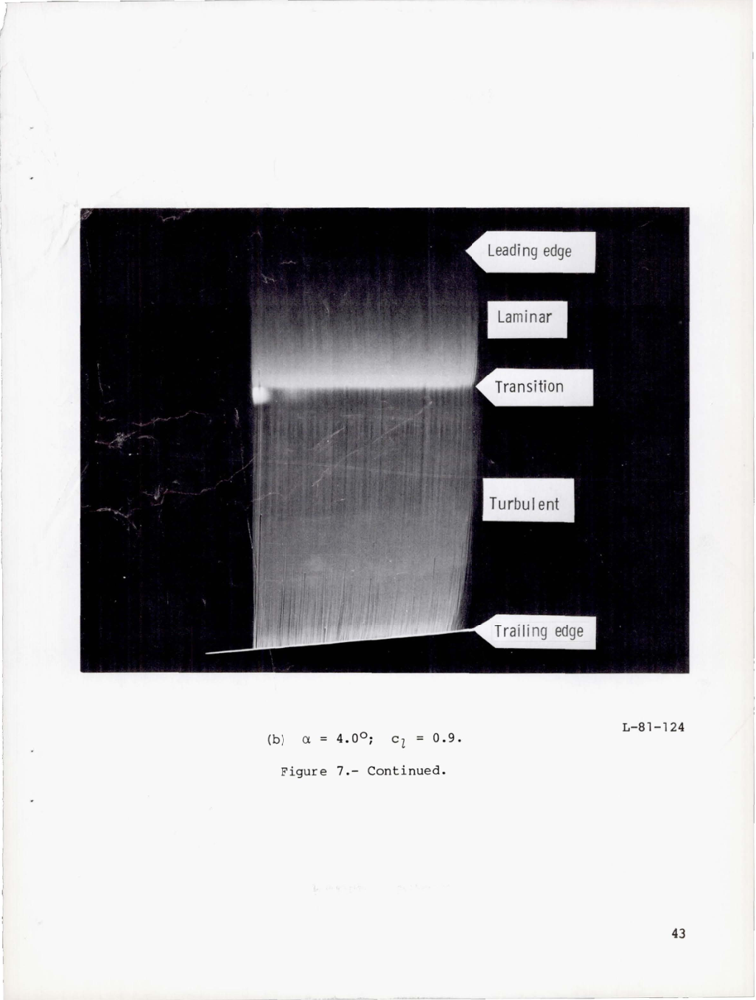
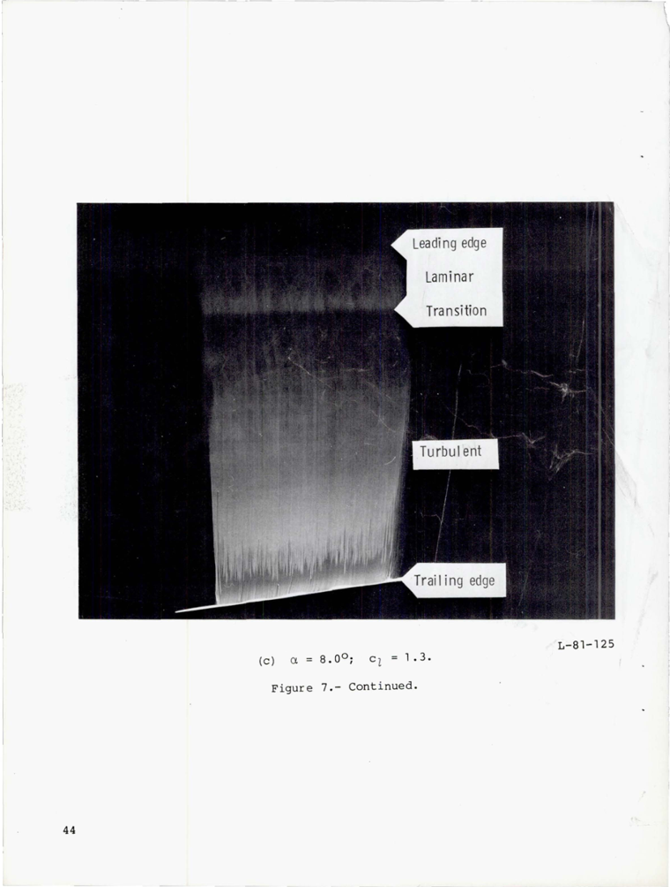

# Extracting the NLF(1)-0416 experimental transition locations

**Purpose.** Document exactly how the experimental transition locations used in
§V (Table 4, `tab:nlftrans`) were obtained from the primary experimental report,
so the numbers are traceable and reproducible.

**Result (what went into the paper).** Transition location $x_\text{tr}/c$ on the
NLF(1)-0416 at $Re=4\times10^6$, read from the wind-tunnel data and mapped to each
computed incidence through the section lift coefficient:

| $\alpha$ | $c_l$ | upper $x_\text{tr}/c$ | lower $x_\text{tr}/c$ |
|:---:|:---:|:---:|:---:|
| 0° | 0.49 | 0.38 | 0.55 |
| 4° | 0.95 | 0.31 † (extrapolated) | 0.62 |
| 9° | 1.48 | — (unresolved) | 0.64 |
| 15° | 1.94 | — (beyond measured $c_{l,\max}$) | 0.66 † (extrapolated) |

† **Extrapolated beyond the recorded orifices.** Upper at 4° sits just ahead of
the forwardmost transition orifice ($x/c\approx0.30$); lower at 15° lies beyond
the measured $c_{l,\max}\approx1.68$, read off the nearly flat lower branch. The
upper onset for $\alpha\geq9°$ is too far forward to resolve or usefully
extrapolate.

---

## 1. Source

All experimental transition data come from the original design-and-test report:

> **Somers, D. M.**, *Design and Experimental Results for a Natural-Laminar-Flow
> Airfoil for General Aviation Applications*, **NASA TP-1861**, June 1981.
> (`references.bib` key `somers_1981`; downloaded from NTRS,
> `19810015487`.)

Two figures in that report carry transition information:

- **Figure 9 — transition location vs. section lift coefficient.** Four panels,
  one per Reynolds number ($R=1,2,3,4\times10^6$). Panel **(d)** is our condition
  ($R=4\times10^6$). This is the *quantitative* source.
- **Figure 7 — oil-flow photographs of the upper surface** at $R=2\times10^6$,
  for $\alpha=0°,4°,6°,8°$. Qualitative, but each panel's caption states the
  measured $(\alpha, c_l)$ pair, which we use as lift-curve anchors.

There is **no numerical table** of transition locations in the report — the data
exist only as plotted symbols, so the values must be digitized from the figure.

## 2. What Figure 9(d) shows



The plot is **$x_T/c$ (horizontal) vs. $c_l$ (vertical)**. Each surface has a row
of pressure/transition orifices along the chord; at each test $c_l$ the report
marks, for every orifice:

- **open symbol** → flow at that orifice is still **laminar**,
- **solid symbol** → flow at that orifice is **turbulent**.

Circles = upper surface, squares = lower surface (see the legend). The transition
front at a given $c_l$ therefore lies **between the last open and the first solid
symbol**; Somers draws a curve through that boundary. We read that curve.

The zoomed positive-$c_l$ region (the range our cases occupy) is where the
reading is done:



Key structural facts visible here, which shape the table:

- The **lower-surface** front (squares) is resolved across the whole $c_l$ range:
  it moves from $\approx0.53\,c$ at $c_l=0.45$ back to a nearly constant
  $\approx0.65$–$0.67\,c$ for $c_l\gtrsim0.7$.
- The **upper-surface** front (circles) is only resolved up to $c_l\approx0.68$
  ($x_T/c\approx0.33$). Above that the transition has moved **ahead of the
  forwardmost transition orifice** ($x/c\approx0.30$), so there are simply no
  upper-surface symbols — the experiment cannot locate it. This is why the upper
  entries for $\alpha=4°,9°$ are "—" (unresolved) rather than a number.
- The highest measured $c_l$ is $\approx1.75$; the digitized polar (Fig. 11d)
  gives $c_{l,\max}\approx1.68$. Our $\alpha=15°$ case has $c_l\approx1.94$,
  **beyond the measured range** — hence "—" there.

## 3. Digitization procedure

1. **Render the scanned page.** The NTRS PDF is a scan; `pdftoppm` was
   unavailable, so pages were rasterized with PyMuPDF:
   ```python
   import fitz
   d = fitz.open("somers1861.pdf")
   d[52].get_pixmap(dpi=170).save("somers_p53.png")   # PDF page 53
   ```
   **Page offset:** report page 48 = PDF page 50 (Fig. 9a), so Fig. 9(d) on
   report page 51 is **PDF page 53**. Verified by reading the panel caption
   ("(d) R = 4.0 × 10⁶").

2. **Calibrate and read.** With the gridlines (major every $0.1$ in $x$, every
   $0.2$ in $c_l$; minor $0.02$ / $0.04$) the transition-front curve was read at
   a set of knots. The digitized $(c_l, x_\text{tr})$ knots are:

   - **upper:** (0.68, 0.33), (0.57, 0.40), (0.45, 0.45), (0.33, 0.455),
     (0.21, 0.465), (0.09, 0.475)
   - **lower:** (0.45, 0.53), (0.57, 0.61), (0.68, 0.64), (0.85, 0.65),
     (1.00, 0.65), (1.20, 0.655), (1.40, 0.66), (1.60, 0.66), (1.75, 0.67)

   Reading uncertainty is about **±0.03 c** (roughly one orifice spacing).

## 4. Mapping $c_l \rightarrow \alpha$

The experiment indexes transition by $c_l$; our RANS cases are at fixed
$\alpha$. Because transition location is set by the pressure distribution, which
correlates with $c_l$ far more tightly than with $\alpha$, the physically correct
comparison is **at matched $c_l$**: take each computed case's section $c_l$ and
read the experimental front there. The computed (structured L2) lift coefficients
are $c_l = 0.49, 0.95, 1.48, 1.94$ for $\alpha=0°,4°,9°,15°$.

This mapping is cross-checked against the report's own $(\alpha, c_l)$ anchors
from the Fig. 7 oil-flow captions (§5): $0°\!\to\!0.4$, $4°\!\to\!0.9$,
$8°\!\to\!1.3$ (at $R=2\times10^6$). The lift curve is consistent (a constant
$\approx0.1$ offset between the computed $c_l$ and the tunnel $c_l$ at matched
$\alpha$, the usual NLF over-prediction), confirming the mapping is sound.

The extraction, with the $\alpha$ read-offs marked, is summarized here:



## 5. Corroboration — the oil-flow photographs (Fig. 7, $R=2\times10^6$)

The upper-surface transition that Fig. 9(d)'s orifices cannot resolve above
$c_l\approx0.7$ is shown directly (if only qualitatively) by the oil-flow
photographs, which also anchor the lift curve:

| $\alpha=0°$, $c_l=0.4$ | $\alpha=4°$, $c_l=0.9$ | $\alpha=8°$, $c_l=1.3$ |
|:---:|:---:|:---:|
|  |  |  |

These show the upper-surface front marching forward with incidence, and at
$\alpha=0°$ it is a **laminar-separation bubble** ("laminar separation /
turbulent reattachment" label) near mid-chord — consistent with the Fig. 9(d)
upper reading of $\approx0.43\,c$ at $c_l\approx0.5$ and with the SA-AI
prediction of a mid-chord onset there.

## 6. Reproducibility

- **Table generator:** `regen_nlf_transition.py` — loads the digitized knots,
  the RANS $c_l$/$x_\text{tr}$ (`total_forces_v2.csv`, `xtr_history.csv`), and the
  mfoil reference (`mfoil_nlf0416_Re4M.pkl`), and prints the Table 4 rows. It also
  flags the mfoil surfaces that separate before $N_\text{crit}$.
- **Overlay figure:** the `digitization_overlay.png` above (inline script).
- **Source renders:** `figs/exp_transition/` holds the downscaled Fig. 9(d) and
  Fig. 7 crops used here; regenerate from `somers1861.pdf` with the PyMuPDF
  snippet in §3.

## 7. Caveats

- Values are **hand-digitized** from a scanned figure; treat them as
  **±0.03 c**.
- The experiment is at slightly different Reynolds number for the oil-flow set
  ($2\times10^6$ vs. the $4\times10^6$ orifice data); transition moves marginally
  forward with increasing $Re$, so the photos are corroborative, not quantitative.
- Upper-surface transition for $c_l\gtrsim0.7$ is genuinely **not measured**
  (forward of the instrumentation), not merely hard to read.
